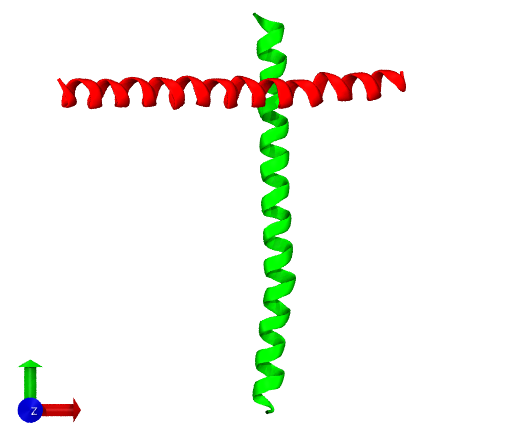
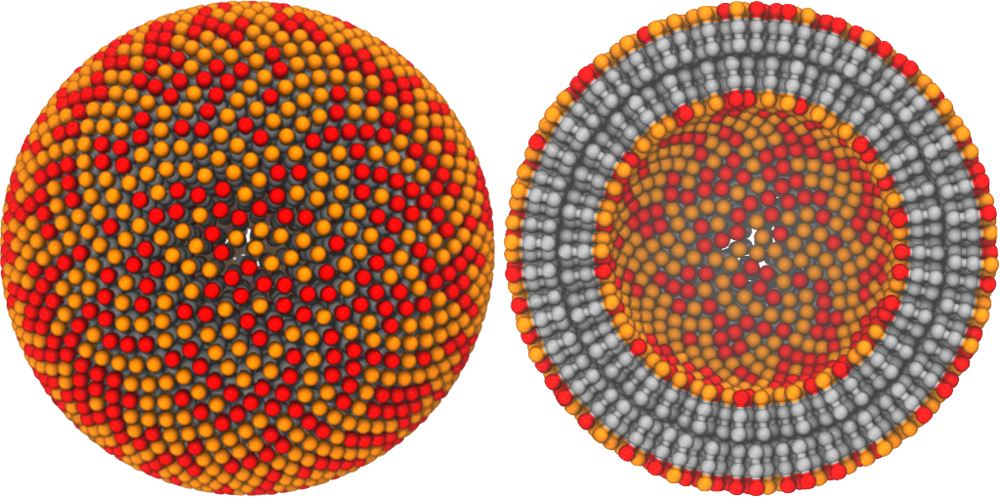

# Contents

I've tried to keep the programs as (potentially large) self-contained monolithic files rather than scattering large numbers of support files across this directory. Wherever sensible, I've broken out the modular re-usable elements into files in the `Util/` directory.

This guide assumes basic familiarity with the [PDB file format](https://www.wwpdb.org/documentation/file-format-content/format33/v3.3.html), specifically the various data fields in [ATOM](https://www.wwpdb.org/documentation/file-format-content/format33/sect9.html#ATOM) entries (which are typically used when defining filters for atomic data in the utilities etc).

The compiled molecular utilities are:

* [AxisAlign](#AxisAlign)
* [BestStructuralMatch](#BestStructuralMatch)
* [Centroids](#Centroids)
* [Distances](#Distances)
* [FluctuationSpectrum](#FluctuationSpectrum)
* [FluctuationSpectrum2](#FluctuationSpectrum2)
* [GenerateMembranes](#GenerateMembranes)
* [LammpsCombiner](#LammpsCombiner)
* [LammpsToXYZ](#LammpsToXYZ)
* [SphereArbitrary](#SphereArbitrary)
* [SphereBySubdivision](#SphereBySubdivision)
* [Superpose](#Superpose)
* [UnwrapTrajectory](#UnwrapTrajectory)

##  AxisAlign

_Align the molecular axes of a PDB structure to the specified Cartesian axes, with the option to use only a filtered subset of the particles in the calculation of the molecular axes._

This functionality is useful for visualization, and aligned molecules are useful for e.g. building up complicated molecular systems with specific initial conditions.

Running the program with no command line options revelas a brief user guide:

	MolecularUtilities $ bin/AxisAlign 

	Usage: bin/AxisAlign <input PDB> [-]x|y|z [-]x|y|z [-]x|y|z [ "key1=val1,val2-val3;key2=val4" ]

	Where:
	  - Cartesian axis order overrides the defauly x,y,z. ALL axes must be specified, and a leading '-' indicates the axis is reflected.
	  - An optional set of filters can be included for the generation of the molecular axes.

	Output is 'mol_axes.pdb' (molecular axes) and 'aligned.pdb' (PDB aligned to specified axes).
	Note that 'mol_axes.pdb' refers to the original PDB file, not the aligned structure.

	Example:

	bin/AxisAlign blah.pdb y -z x "name=CA;resSeq=1,3,12-14,20-50"

	This aligns the major axis of the specified atoms in molecule in blah.pdb to the y axis,
	the secondary axis to the flipped z axis (i.e. {0,0,-1}) and the minor axis to the Cartesian
	x axis.

	MolecularUtilities $ 

**Example**: the alpha helical chain B of the [2ymk](https://www.rcsb.org/structure/2ymk) PDB structure (included in the `PDB_sources` directory) is initially aligned somewhat parallel to the Cartesian x-axis; we can instead align it such that the major molecular axis is parallel to the Cartesian y-axis, the secondary molecular axis is aligned to the Cartesian x-axis, and the minor axis is aligned to the Cartesian z-axis:

	 bin/AxisAlign PDB_sources/2ymk.B.pdb y x z "name=CA"

Here, we define a filter such that only the carbon alpha atoms of the protein backbone (`name=CA`) are used to calculate the molecular axes. The results are shown below, where the initial structure is rendered in red and the aligned structure is in green. At the lower left of the image can be seen a set of axis indicators, where Cartesian x-, y- and z-axes are shown using red, green, and blue arrows respectively.

##  BestStructuralMatch

_This program finds the molecular structure in a data set that has the lowest root-mean-squared deviation (RMSD) from a reference structure after superposing the two structures for minimized RMSD._

This functionality is useful to identify one or more "typical" conformations of a molecule, given an ensemble of structures.

Running the program with no command line options reveals a brief user guide:

	MolecularUtilities $ bin/BestStructuralMatch 

	Usage: bin/BestStructuralMatch reference.pdb set_size data.pdb [filter_name=v1,v2,...] [filter_name=v1,v2,...]

	Where:
	  - reference.pdb : the reference structure(s) to compare to
	  - set_size : number of consecutive PDB molecules in the input file to group
	  - data.pdb : the potential candidate structures to compare to reference.pdb
	  - OPTIONAL filters : used in the superposition/RMSD comparison

	Notes:
	  Consecutive set_size entries from reference.pdb and data.pdb are grouped for superposition/RMSD calculation.
	  Closest match to reference in data set saved to 'best_match.pdb', with some info in REMARK lines.
	  ALL atom data is written in 'best_match.pdb', not just the atoms used in the superposition/RMSD calculation.

	MolecularUtilities $ 

**Example**: the [3P05](https://www.rcsb.org/structure/3P05) PDB file contains a ring of five proteins from the human immunodeficiency virus type 1 (HIV-1). Although the proteins in this ring are in principle identical, the experimental structures for each protein are slightly different due to e.g. thermal fluctuations. Let's see how different they are:

	MolecularUtilities $ bin/BestStructuralMatch PDB_sources/3P05.pdb 1 PDB_sources/3P05.pdb name=CA resSeq=1-145
	Set     1 : 136 common filtered atoms : RMSD        0.000 =>        0.000 <- best so far
	Set     2 : 126 common filtered atoms : RMSD       29.868 =>        0.209
	Set     3 : 126 common filtered atoms : RMSD       48.329 =>        0.159
	Set     4 : 126 common filtered atoms : RMSD       48.516 =>        0.192
	Set     5 : 125 common filtered atoms : RMSD       29.813 =>        0.164
	Unable to load 1 structures from 'PDB_sources/3P05.pdb'; only managed 0! Assuming EOF and stopping here.
	MolecularUtilities $

Here we specify to only use atoms with name `CA` for the comparison, and only use residue numbers 1 to 145 in each protein (the "heads" of each molecule).

The output tells us how many atoms pass the filter for each molecule in the data file, and the RMSD for the reference structure before and after superposition. Not surprisingly, the closest match to the reference structure from `3P05.pdb` (assumed to be the first entry in the file) is ... the first entry in the `3P05.pdb` file! However, we can see that the structure of the "heads" of other proteins in the ring are also very similar (< 1 Angstrom RMSD).

##  Centroids

_Extract the centroid "pseudoparticles" (i.e. the averaged position of each particle) from a set of PDB input structures._

This functionality is useful to generate the average location of particles whose locations fluctuate. It can be combined with the [BestStructuralMatch](#BestStructuralMatch) program to generate the "average" structure of a molecule, given a set of similar natural conformations, and then determine the conformation that is the closest match to this "average" structure.

Running the program with no command line options reveals a brief user guide:

	MolecularUtilities $ bin/Centroids 

	Usage: bin/Centroids input.pdb set_size

	Where:
	  - set_size : number of consecutive PDB molecules in the input file to group

	MolecularUtilities $ 

As shown in the output information above, the user may specify a `set_size` parameter to indicate how many consecutive entries in the PDB file are treated as a single "molecule" (with entries delineated by `TER` lines). This parameter is typically `1`.

##  Distances

_Measure statistics regarding the distances between PDB atoms in multiple data sets._

This functionality can be useful when estimating effective particle volumes in a coarse-grained model using fine-grained structural data, and therefore for initial estimates for force field parameters etc.

Running the program with no command line options reveals a brief user guide:

	MolecularUtilities $ bin/Distances

	Usage: bin/Distances input=name:filepath.pdb[:min_samples[:set_size]] input=name:filepath.pdb ... rcut=X [filters="filter_string;filter_string;..."] [same="name:resSeq,name:resSeq;name:resSeq,name:resSeq;..."] [histogram_prefix=X] [histogram_res=X]

	Where:
	  - input : define an input PDB:
	      - name : name for input set.
	      - min_samples : OPTIONAL minimum number of samples required to print distances (default = 1).
	      - set_size : OPTIONAL only measure over consecutive 'set_size' mol groups (useful for structures superposed onto common reference frame, default = all in file).
	  - filters : PDB-style filtering.
	  - same : OPTIONAL definition of atoms to consider the same, to generate/prints additional distance info.
	  - histogram_prefix : OPTIONAL prefix for saved histograms of distances; if not specified, no histograms written.
	  - histogram_res : OPTIONAL resolution (bins per unit distance) for histograms (ignored if histogram_prefix not defined).

	Examples:
	  bin/Distances input=test:blah.pdb:4 rcut=10.0 filters="name:CA;resSeq:3,6,12-45,112-116" same="CA:18,GCA:18;CA:45,GCA:45" 
	  bin/Distances input=test1:blah1.pdb:4 input=test2:blah2.pdb:4:2 rcut=10.0 filters="name:CA;resSeq:3,6,12-45,112-116" same="CA:18,GCA:18;CA:45,GCA:45" 

	MolecularUtilities $ 

**Example**: the [3P05](https://www.rcsb.org/structure/3P05) PDB file contains a ring of five proteins from the human immunodeficiency virus type 1 (HIV-1). The proteins in this ring are in principle identical, but the experimental structures for each protein are slightly different due to e.g. thermal fluctuations. This also means that the separations between pairs of particles in adjacent proteins "around" the ring will likewise differ slightly. Let's take a look at the carbon alpha atoms of the first 20 residues of each protein, ignoring any pairs further apart than 10 Angstrom (1 nanometer):

	MolecularUtilities $ bin/Distances input=test:PDB_sources/3P05.pdb rcut=10 filters="name:CA;resSeq:1-20"
	Inputs:
		 'input=test:PDB_sources/3P05.pdb'
	Parameters:
		 'filters' => 'name:CA;resSeq:1-20'
		 'rcut' => '10'

	*
	* 'test' : 'PDB_sources/3P05.pdb', min_samples 1, set_size <unspecified, using all molecules in file>
	*

	Read 5 molecules.
	79 atoms total passed filtering.
	Adjusting set_size from -1 to 5 (number of filtered molecules)

	  name_i name_j :      min     mean      max   stddev   stderr (   N) Ascending list of distances ...
	      CA:3 CA:6 :    8.804    8.804    8.804    0.000    0.000 (   1)    8.804 
	     CA:3 CA:13 :    8.431    8.431    8.431    0.000    0.000 (   1)    8.431 
	     CA:3 CA:14 :    8.310    8.310    8.310    0.000    0.000 (   1)    8.310 
	      CA:4 CA:6 :    8.362    8.362    8.362    0.000    0.000 (   1)    8.362 
	      CA:4 CA:7 :    9.797    9.797    9.797    0.000    0.000 (   1)    9.797 
	     CA:4 CA:11 :    9.215    9.215    9.215    0.000    0.000 (   1)    9.215 
	     CA:4 CA:12 :    8.097    8.097    8.097    0.000    0.000 (   1)    8.097 
	     CA:4 CA:13 :    7.238    8.555    9.872    1.862    1.317 (   2)    7.238    9.872 
	     CA:4 CA:14 :    8.726    8.726    8.726    0.000    0.000 (   1)    8.726 
	      CA:5 CA:5 :    9.639    9.639    9.639    0.000    0.000 (   1)    9.639 
	      CA:5 CA:6 :    5.844    5.844    5.844    0.000    0.000 (   1)    5.844 
	      CA:5 CA:7 :    6.943    6.943    6.943    0.000    0.000 (   1)    6.943 
	      CA:5 CA:8 :    9.221    9.221    9.221    0.000    0.000 (   1)    9.221 
	     CA:5 CA:11 :    8.944    8.944    8.944    0.000    0.000 (   1)    8.944 
	     CA:5 CA:12 :    9.050    9.050    9.050    0.000    0.000 (   1)    9.050 
	     CA:5 CA:13 :    8.007    8.007    8.007    0.000    0.000 (   1)    8.007 
	      CA:6 CA:9 :    9.417    9.417    9.417    0.000    0.000 (   1)    9.417 
	     CA:6 CA:10 :    9.228    9.228    9.228    0.000    0.000 (   1)    9.228 
	     CA:6 CA:11 :    6.671    6.671    6.671    0.000    0.000 (   1)    6.671 
	     CA:6 CA:12 :    8.042    8.042    8.042    0.000    0.000 (   1)    8.042 
	     CA:6 CA:13 :    7.742    7.742    7.742    0.000    0.000 (   1)    7.742 
	      CA:7 CA:9 :    8.772    8.772    8.772    0.000    0.000 (   1)    8.772 
	     CA:7 CA:10 :    9.572    9.572    9.572    0.000    0.000 (   1)    9.572 
	     CA:7 CA:11 :    7.564    7.564    7.564    0.000    0.000 (   1)    7.564 
	     CA:7 CA:12 :    9.784    9.784    9.784    0.000    0.000 (   1)    9.784 
	      CA:8 CA:9 :    9.932    9.932    9.932    0.000    0.000 (   1)    9.932 
	     CA:8 CA:10 :    9.488    9.488    9.488    0.000    0.000 (   1)    9.488 
	     CA:8 CA:11 :    6.587    6.587    6.587    0.000    0.000 (   1)    6.587 
	     CA:8 CA:12 :    7.798    7.798    7.798    0.000    0.000 (   1)    7.798 
	     CA:8 CA:13 :    9.048    9.048    9.048    0.000    0.000 (   1)    9.048 
	    CA:16 CA:17 :    9.317    9.520    9.820    0.207    0.092 (   5)    9.317    9.332    9.556    9.575    9.820 
	    CA:16 CA:18 :    9.289    9.502    9.852    0.269    0.134 (   4)    9.289    9.295    9.573    9.852 
	    CA:16 CA:19 :    8.430    8.657    8.890    0.203    0.091 (   5)    8.430    8.468    8.693    8.805    8.890 
	    CA:17 CA:17 :    9.829    9.913    9.997    0.119    0.084 (   2)    9.829    9.997 
	    CA:17 CA:18 :    6.530    6.871    7.129    0.260    0.116 (   5)    6.530    6.679    6.933    7.086    7.129 
	    CA:17 CA:19 :    5.464    5.618    5.739    0.113    0.051 (   5)    5.464    5.582    5.585    5.720    5.739 
	    CA:17 CA:20 :    9.035    9.175    9.352    0.137    0.061 (   5)    9.035    9.039    9.219    9.231    9.352 
	    CA:18 CA:18 :    6.592    6.747    7.021    0.173    0.077 (   5)    6.592    6.652    6.661    6.810    7.021 
	    CA:18 CA:19 :    7.220    7.527    7.767    0.245    0.109 (   5)    7.220    7.312    7.644    7.693    7.767 
	    CA:19 CA:20 :    9.745    9.822    9.989    0.114    0.057 (   4)    9.745    9.751    9.802    9.989 
	MolecularUtilities $

Here we only examine distances from a single input set (`3P05`), but you can actually pass in multiple files and see a side-by-side comparison of the distance data to look for any interesting differences.

##  FluctuationSpectrum

_Generate the fluctuation spectra for a bilayer membrane from LAMMPS trajectories (using specialized LAMMPS file handling code)._

This functionality can be useful in determining certain physical properties of a membrane system, for example the compressibility modulus or the bending modulus, by performing a 2-D Fourier transform of the membrane interface and generating a spectra of the undulatory motions.

Running the program with no command line options reveals a brief user guide:

	MolecularUtilities $ bin/FluctuationSpectrum

	Usage: bin/FluctuationSpectum  traj=path  max_k=X max_l=X  head_type=X[,X,...] tail_type=X[,X,...]  gx=X gy=X  [delta_q=X] [scale=X] [which=X] [histogram=X] [out_prefix=X] [filter=X] [remap=X]

	Where:
	  - max_k, max_l : max integer wave numbers on x and y axes respectively.
	  - head_type, tail_type : LAMMPS atom types for head and terminal tail beads.
	  - gx, gy  : grid cell counts on x and y axes for midplane calculations.

	  - delta_q   : OPTIONAL resolution of output spectrum histogram (default: 0.05).
	  - scale     : OPTIONAL scaling for input->output length units (default: 1.0).
	  - which     : OPTIONAL setting for which monolayer: 'upper', 'lower', 'both', 'midplane' (default: 'both').
	  - histogram : OPTIONAL per-type histogram bin width in OUTPUT length units (ignored where <= 0.0).
	  - save_midplane : OPTIONAL flag to save the midplane coordinates as xyz (default: no midplane written).
	  - out_prefix: OPTIONAL output spectrum file prefix (default: 'spectrum').
	  - filter: OPTIONAL grid filter cell size, with contents of isolated cells ignored (default: no filtering).
	  - remap: OPTIONAL remap specifier, with most populated cell (via specified type) used recentre/wrap data (default: no remapping).
	  - start: OPTIONAL unit-based start frame in trajectory. Negative values ignored (default: -1).
	  - stop: OPTIONAL unit-based stop frame in trajectory. Negative values ignored (default: -1).
	  - save_raw: OPTIONAL flag to save raw (i.e. non-binned) spectral values. Negative values ignored (default: -1).

	Notes:
	  - Be careful if you use 'which=midplane', as the high frequency components of the spectrum (larger q values)
	    will be limited by the resolution of the midplane grid (as specified by 'gx' and 'gy' parameters).
	  - The filtering assigns head group particles to a 3D grid with the specified size. Any cells with no neighbours
	    have their contents ignored.

	MolecularUtilities $ 

##  FluctuationSpectrum2

This program is functionally identical to [FluctuationSpectrum](#FluctuationSpectrum), but instead of using the specialized LAMMPS file handling code it uses a more general representation of atoms and molecules etc. This in principle allows the straightforward addition of atomic filtering and support for other file formats etc, but it's also slightly slower and requires more memory.

I've therefore included these two programs as separate entries for now.

##  GenerateMembranes

_Create monolayer and/or bilayer systems using user-defined lipid molecules and surface geometries._

This functionality can be useful when creating the initial system configuration for simulations of biological monolayer and bilayer interfaces.

Running the program with no command line options reveals a brief user guide:

	MolecularUtilities $ bin/GenerateMembranes

	Usage: bin/GenerateMembranes [bond_length=X] [leaflet_separation=X] [lipid=t1,t1,...[:b1,b2,...][:a1,a2,...], ...] [sphere=monolayer|bilayer:COMPOSITION:outer_r:APL, ...] [plane=bilayer|monolayer:COMPOSITION:N:APL, ...]

	Where:
	  - bond_length: OPTIONAL default separation between bound particles (default: 7.5 Angstrom)
	  - leaflet_separation: OPTIONAL separation between inner and outer monolayere leaflets in a bilayer (default: 7.5 Angstrom)
	  - lipid: lists of particle types defining a lipid molecule, followed by optional lists of bond and angle types (default bond and angle type: 1)
	  - sphere: define a spherical mono- or bilayer of the specified lipid composition, radius, and area per lipid
	  - plane: define a planar mono- or bilayer of the specified lipid composition, NxN lipid grid, and area per lipid
	  
	  COMPOSITION : comma-separated lists of lipid types and their relative proportions, separated by question mark.

	Examples:

	  1. bin/GenerateMembranes lipid=1,2,3 sphere=bilayer:1:100:70
  
	  - Define a 3-site lipid (atom types 1,2,3), referred to in future as lipid type 1.
	  - Create a spherical bilayer (using lipid type 1) of radius 100 Angstrom and area per lipid 70 Angstrom**2.
  
	  2. bin/GenerateMembranes bond_length=7.5 leaflet_separation=7.5 lipid=1,2,3,3,3 lipid=1,2,3 sphere=bilayer:1,2?1,1:100:70
  
	  - Specify a default bond length connecting particles of length 7.5 Angstrom.
	  - Specify a default separation of 7.5 Angstroms between monolayer leaflets.
	  - Define TWO lipid types:
	      - Lipid type 1 contains 5 particles (particle types: 1,2,3,3,3).
	      - Lipid type 2 contains 3 particles (particle types: 1,2,3).
	  - Create a spherical bilayer with the following properties:
	      - Use lipid types 1 and 2 to create a 1:1 ratio of lipids in the bilayer.
	      - Bilayer radius is 100 Angstrom, area per lipid is 70 Angstrom**2.
  
	  3. bin/GenerateMembranes lipid=1,2,3,3,3 lipid=1,2,3 sphere=bilayer:1,2?10,12:100:70
  
	  - Define TWO lipid types:
	      - Lipid type 1 contains 5 particles (particle types: 1,2,3,3,3).
	      - Lipid type 2 contains 3 particles (particle types: 1,2,3).
	  - Create a spherical bilayer with the following properties:
	      - Use lipid types 1 and 2 to create a 10:12 ratio of lipids in the bilayer.
	      - Bilayer radius is 100 Angstrom, area per lipid is 70 Angstrom**2.
  
	  Notes:
  
	    - Lipid types are UNIT BASED and correspond to the order in which lipid definitions occurred.
	    - Molecule proportions are normalised internally, so they don't need to sum to 1 on the command line.
	    - If molecule proportions omitted, equal proportions used.

	MolecularUtilities $ 

**Example**: Imagine we require the starting configuration for simulations of a small 2-component bilayer vesicle system, with the vesicle membrane composed of a random mixture of coarse-grained (CG) lipid molecules at a ratio of 2:3. If we assume that the CG lipids have chemically similar hydrocarbon "tail" beads, and differ only in their hydrophilic "head" regions, one such system might be generated as follows:

	MolecularUtilities $ bin/GenerateMembranes lipid=1,2,2 lipid=3,2,2 sphere=bilayer:1,2?2,3:100:70

	*
	* Input parameters
	*

	Molecule:
	  atom types: 1 2 2 
	  bonds: [1,1,2] [1,2,3] 
	  angles: [1,1,2,3] 
	  coords:
	    0 0 0
	    0 0 7.5
	    0 0 15
	Molecule:
	  atom types: 3 2 2 
	  bonds: [1,1,2] [1,2,3] 
	  angles: [1,1,2,3] 
	  coords:
	    0 0 0
	    0 0 7.5
	    0 0 15

	Sphere defined:
	  type: bilayer
	  mol types/props:
	    1 0.4
	    2 0.6
	  outer_r: 100
	  target APL: 70

	bond_length = 7.5
	leaflet_separation = 7.5

	*
	* Generating surfaces
	*

	Sphere.
	  Outer leaflet : radius 100, 1539 lipids, VPL = 1050.26, APL 81.6528
	  Inner leaflet : radius 62.5, 883 lipids, VPL = 1050.01, APL 55.5916

	MolecularUtilities $ 

Here, we defined two lipid types with a different "head" bead type, but both have two identical hydrocarbon "tail" beads. The resultant output configuration is shown below, as both a "full" view of the system and a "cut-away" view to better see the bilayer structure; the "head" beads of lipid types 1 and 2 are shown in red and orange respectively, and the "tail" beads are shown in gray.

##  LammpsCombiner

_Combine LAMMPS config files, automatically renumbering bonds and angles etc._

This functionality can be useful when you wish to combine separate LAMMPS config files to produce a cohesive configuration for simulation, ensuring all the atoms, molecules, bonds, angles, etc are correctly numbered and consistent.

Running the program with no command line options reveals a brief user guide:

	MolecularUtilities $ bin/LammpsCombiner

	Usage: bin/LAMMPSCombiner path:dx,dy,dz:adjust_topo_types path:dx,dy,dz:adjust_topo_types [check=X]

	Where:
	  - path : LAMMPS config file
	  - dx,dy,dz : offsets to translate system
	  - adjust_topo_types : 1 where bond/angle types should be adjusted to follow previous data
	  - check : OPTIONAL max bond length for sanity check of final data

	MolecularUtilities $ 

##  LammpsToXYZ

_Read in a LAMMPS configuration or trajectory file, and write out a file in the simpler [XYZ](https://en.wikipedia.org/wiki/XYZ_file_format) format._

This functionality can be useful when you wish to visualize LAMMPS data, but the specific data file is either not commonly supported by visualization codes (e.g. LAMMPS configuration files) or you wish to reduce file sie and complexity for performance reasons (e.g. LAMMPS trajectory files).

Running the program with no command line options reveals a brief user guide:

	MolecularUtilities $ bin/LammpsToXYZ

	Usage: bin/LAMMPSToXYZ  type  in_path  [out=path] [has_q]

	Where:
	  - type : either 'data' or 'traj'
	  - in_path : path to LAMMPS data file
	  - out_path : OPTIONAL path to outut data file (default: 'output.xyz')
	  - has_q : OPTIONAL switch to assume data files contain charges

	MolecularUtilities $ 

##  SphereArbitrary

_Generate an arbitrary number of roughly equispaced points on the surface of a sphere._

This functionality can be useful when visualizing spherical bounding surfaces, or constructing simulation coordinates.

Running the program with no command line options reveals a brief user guide:

	MolecularUtilities $ bin/SphereArbitrary

	Usage: bin/SphereArbitrary  radius target_N aname rname [TER]

	Where:
	  - radius : radius of sphere, in Angstrom
	  - target_N : desired number of points on sphere surface
	  - aname : atom name for the surface beads
	  - rname : residue name for the surface beads
	  - TER : OPTIONAL flag to insert TER lines after every ATOM

	Example:

	  bin/SphereArbitrary  100.0  350  PNT  SPH > my_sphere.pdb

	MolecularUtilities $ 

##  SphereBySubdivision

_Generate near-equidistant points on the surface of a sphere using poyhedral subdivision._

This functionality can be useful when you require more regularity in the point spacing vs [SphereArbitrary](#SphereArbitrary). However, due to the nature of polyhedral subdivision, it may not be possible to return _exactly_ the number of points requested; is the precise number of points is important, be sure to check the output or simply use [SphereArbitrary](#SphereArbitrary) instead.

Running the program with no command line options reveals a brief user guide:

	MolecularUtilities $ bin/SphereBySubdivision

	Usage: bin/SphereBySubdivision  radius n_subdiv aname rname

	Where:
	  - radius : radius of sphere, in Angstrom
	  - n_subdiv: number of polyhedral subdivisions to perform (larger number = more points)
	  - aname : atom name for the surface beads
	  - rname : residue name for the surface beads

	Notes:
	  - The number of points generated increases RAPIDLY with n_subdiv.
	  - n_subdiv between 2 and 5 is typically a good starting point.

	MolecularUtilities $ 

##  Superpose

_Superpose arbitrary sets of PDB structures onto one another, using filtered atom sets if desired._

This functionality can be useful when converting between coarse-grained (CG) and fine-grained (FG) representations of a molecular system (i.e. swapping all CG molecules for FG molecules, or vice versa). It is also useful where you wish to align sets of structures for visualization etc.

Running the program with no command line options reveals a brief user guide:

	MolecularUtilities $ bin/Superpose

	Usage:

		 bin/Superpose -target=a.pdb[:set_size][:noadvance] -structures=b.pdb[:set_size][:noadvance] -output=c.pdb [ -print_rmsd=yes|no ] [superpose=i,j,...:onto=k,l,...:apply_to=m,n,...:attr1=val1,val2,...:attr2=val1,val2,...] ...

	Where:

	  - target: input PDB with molecules to superpose ONTO
	  - structures: input PDB with molecule to superpose ONTO those in "target"
	  - output: results file
	  - print_rmsd: print the before and after RMSD of superpositions

	And one or more superposition entries, with parameters (separated by colon, ':'):

	  - superpose: molecule indices into current "structures" set, UNIT BASED
	  - onto: molecule indices into current "target" set, UNIT BASED
	  - apply_to: molecule indices into current "structures" set, UNIT BASED
	  - key=values: restrictions on the atoms used in the superposition. For PDB files, these keys are the
	    PDB ATOM attributes such as "name", "resName", "resSeq" etc (see PDB file format).

	Notes:

	   The optional 'set_size' and 'noadvance' parameters control how the contents of input files are considered.
	   Groups of 'set_size' molecules are read in at a time, and it is on these sets that the superpositions act.
	   The default 'set_size' is 1, and by default 'noadvance' is set for 'target' and 'structures' This results in
	   consective sets from 'structures' being superposed onto consective sets from 'target'. Most of the time, you
	   may wish to superpose only the first set of 'structures' onto all sets in 'target', which is specified as so:
  
	   -target=a.pdb:1 -structures=b.pdb:1:noadvance
  
	   Where ranges of values are provided in the values for superposition entries, using the dash character '-',
	   the range is expanded into an INCLUSIVE set of indices. Checks are performed to ensure that the ranges
	   are integers and that the start index is <= end index.
  
	   Where values are provided for the keys in the superposition, the set of atoms to use for the superposition
	   must have attributes in the list provided; where two atoms have attributes in the list specified, but the
	   attributes are not identical for both atoms, those atoms are ignored.
  
	   An empty value list for a particular key denotes that the named attribute must be the same for two atoms to be
	   included in those atoms used for the superposition calculation. any attributes not specified in the superposition
	   definition are simply ignored.

	Examples:

	  1. bin/Superpose -target=tgt.pdb -structures=str.pdb:4:noadvance -output=out.pdb superpose=1,2:onto=1:apply_to=3,4:name=:resName=:resSeq=12-34

	  Calculate superposition of molecules 1 and 2 (combined into single molecule) of str.pdb onto each sequential
	  molecule of tgt.pdb where the atom names and residue names match, and the residue sequences are in the range of
	  12 to 34 (inclusive). This superposition transform is applied to molecules 3 and 4 of str.pdb and the results
	  saved into out.pdb. We specify a set size of 4 for str.pdb, and prevent advancing beyond the first set.

	  2. bin/Superpose -target=tgt.pdb:4 -structures=str.pdb:5:noadvance -output=out.pdb superpose=1,2:onto=1,2:apply_to=3,4,5:name=CA,CB:resName=:resSeq=

	  Calculate superposition of molecules 1 and 2 (combined into single molecule) of the first set of 5 consective molecules in str.pdb
	  onto the combined molecule formed from entries 1 and 2 in each set of tgt.pdb (with tgt.pdb processed using sets of 4 consecutive molecules).
	  The atom names are one of either "CA" or "CB" but must be the same for the paired atoms used in the superposition. The residue
	  names and sequence numbers must match, and the results are saved into out.pdb.

	MolecularUtilities $ 

##  UnwrapTrajectory

_Unwrap molecules in a LAMMPS trajectory so they are not broken across periodic boundaries._

This functionality can be useful when visualizing molecular systems to ensure that molecules are contiguous in space, rather than seeing discontinuities in molecular structures due to coordinates being wrapped across [periodic boundary conditions](https://en.wikipedia.org/wiki/Periodic_boundary_conditions).

Running the program with no command line options reveals a brief user guide:

	MolecularUtilities $ bin/UnwrapTrajectory

	Usage: bin/UnwrapTrajectory in_traj out_traj

	Where:
	  - in_traj : input LAMMPS trajectory
	  - out_traj : output LAMMPS trajectory

	MolecularUtilities $ 
