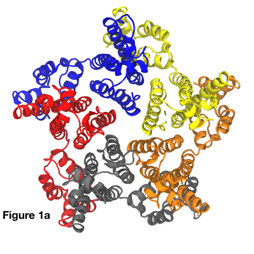
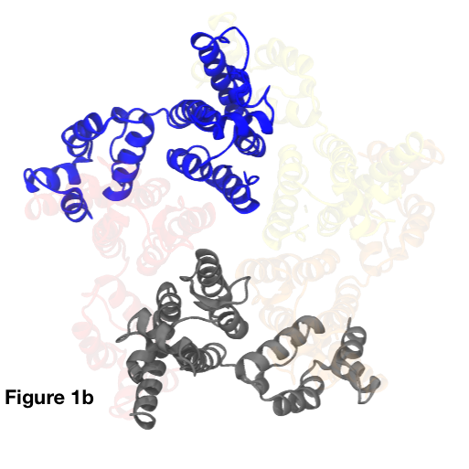
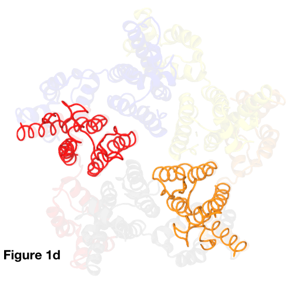
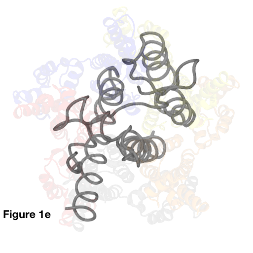

# Python utilities for manipulating PDB data

This guide assumes basic familiarity with the [PDB file format](https://www.rcsb.org/), specifically the various data entries in [ATOM](https://en.wikipedia.org/wiki/Protein_Data_Bank_(file_format)) fields (which are typically used when defining filters for atomic data in the utilities etc).

* [PDBTool.py](#PDBTool)
* [SimoConvert.py](#SimoConvert)
* [IdentifyHIVStructures.py](#IdentifyHIVStructures)

##  PDBTool

*A Swiss army knife for PDB manipulation*

This script performs a wide range of useful operations on PDB data piped in over `stdin`. Running the script with no command line parameters reveals a basic user guide:

	Scripts $ ./PDBTool.py 

	Usage: cat whatever.pdb | PDBTool.py [renumber resSeq_offset] | [fix_chains] | [recentre] | [scale X] | [extract_chains A B C ...] | [extract_mols set_size set_i set_j set_k ...] | [filter key=val,val,... key=val,val,... ]

	Where:

		 renumber        : add resSeq_offset to all residue sequence numbers
		 fix_chains      : sequentially rename chains to A B C ...
		 recentre        : move centre of geometry to the origin
		 scale           : scale coordinates by specified factor
		 extract_chains  : extract the specified chains (IN THE ORDER SPECIFIED!)
		 extract_mols    : extract the UNIT_BASED sets of molecules with sets of specified size from the PDB file (molecule = a TER- or MODEL-separated entry)
		 filter          : filter input PDB with specified filters. Range separator char for resSeq is "-"

	In all cases, the resultant PDB file is printed to stdout.

	Scripts $

**Examples**: The [3P05](https://www.rcsb.org/structure/3P05) PDB file contains a ring of five proteins from the human immunodeficiency virus type 1 (HIV-1). The proteins in this ring are in principle identical, and the overall structure can be seen in **Fig. 1a** with each of the five chains rendered in a different color.

**Example 1**: _Extract chain A and C from the 3P05 structure, redirecting the output to the file `test.pdb`_:

	Scripts $ cat ../PDB_sources/3P05.pdb | ./PDBTool.py filter chainID=A,C > test.pdb
	Scripts $

The results of this operation are shown in **Fig. 1b**, where we observe that only two of the five original chains remain (the original 3P05 structure is shown in the background for comparison).

Note that although chains can be filtered in this manner, this approach will likely result in spurious `TER` lines in the output because _empty molecules are returned from the filter where no atoms match._ If this is a problem, one can instead use the `extract_chains` command to achieve the same results without spurious `TER` lines:

	Scripts $ cat ../PDB_sources/3P05.pdb | ./PDBTool.py extract_chains A C > test.pdb
	Scripts $

**Example 2**: _Extract only the N-terminal domains (i.e., residues in the sequence of approx. 1 to 145 in each chain) from the 3P05 structure_:

	Scripts $ cat ../PDB_sources/3P05.pdb | ./PDBTool.py filter resSeq=1-145 > test.pdb
	Scripts $

The results of this operation are shown in **Fig. 1c**, where we observe the molecular "skirt" surrounding the central ring structure (formed of residues in the sequence of approx. 1 to 145) has been removed.

*#Example 3#*: _Extract only the carbon alpha atoms of the N-terminal domains of chains B and D of the 3P05 structure_:

	Scripts $ cat ../PDB_sources/3P05.pdb | ./PDBTool.py filter name=CA resSeq=1-145 chainID=B,D > test.pdb
	Scripts $

The results of this operation are shown in **Fig. 1d**, where we observe the molecular complexity has been significantly reduced in addition to removing the molecular "skirt" of the extracted chains.

Note that this same result can also be achieved by piping the results of a filter operation back into `PDBTool` with the `extract_chains` option:

	Scripts $ cat ../PDB_sources/3P05.pdb | ./PDBTool.py filter name=CA resSeq=1-145 | ./PDBTool.py extract_chains B D > test.pdb
	Scripts $

**Example X**: _Extract only the carbon alpha atoms of the N-terminal domain of 3P05's chain C, recenter it, and then scale it by a factor of two_:

	Scripts $ cat ../PDB_sources/3P05.pdb | ./PDBTool.py filter name=CA resSeq=1-145 | ./PDBTool.py extract_chains C | ./PDBTool.py recentre | ./PDBTool.py scale 2 > test.pdb
	Scripts $

The results of this rather bizarre sequence of operations is shown in **Fig. 1e**.

