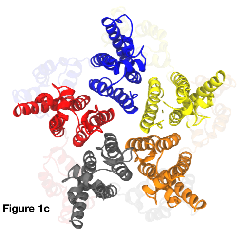

# Python utilities for manipulating PDB data

This guide assumes basic familiarity with the [PDB file format](https://www.rcsb.org/), specifically the various data entries in [ATOM](https://en.wikipedia.org/wiki/Protein_Data_Bank_(file_format)) fields (which are typically used when defining filters for atomic data in the utilities etc).

* [PDBTool.py](#PDBTool)
* [SimoConvert.py](#SimoConvert)
* [IdentifyHIVStructures.py](#IdentifyHIVStructures)

##  PDBTool

_A Swiss army knife for PDB manipulation_

This script performs a wide range of useful operations on PDB data piped in over `stdin`. Running the script with no command line parameters reveals a basic user guide:

	Scripts $ ./PDBTool.py 

	Usage: cat whatever.pdb | PDBTool.py [renumber resSeq_offset] | [fix_chains] | [recentre] | [scale X] | [extract_chains A B C ...] | [extract_mols set_size set_i set_j set_k ...] | [filter key=val,val,... key=val,val,... ]

	Where:
	  - renumber        : add resSeq_offset to all residue sequence numbers
	  - fix_chains      : sequentially rename chains to A B C ...
	  - recentre        : move centre of geometry to the origin
	  - scale           : scale coordinates by specified factor
	  - extract_chains  : extract the specified chains (IN THE ORDER SPECIFIED!)
	  - extract_mols    : extract the UNIT_BASED sets of molecules with sets of specified size from the PDB file (molecule = a TER- or MODEL-separated entry)
	  - filter          : filter input PDB with specified filters. Range separator char for resSeq is "-"

	In all cases, the resultant PDB file is printed to stdout.

	Scripts $

**Examples**: The [3P05](https://www.rcsb.org/structure/3P05) PDB file contains a ring of five proteins from the human immunodeficiency virus type 1 (HIV-1). The proteins in this ring are in principle identical, and the overall structure can be seen in **Fig. 1a** with each of the five chains rendered in a different color.

**Example 1**: _Extract chains A and C from the 3P05 structure, redirecting the output to the file `test.pdb`_:

	Scripts $ cat ../PDB_sources/3P05.pdb | ./PDBTool.py filter chainID=A,C > test.pdb
	Scripts $

The results of this operation are shown in **Fig. 1b**, where we observe that only two of the five original chains remain (the original 3P05 structure is shown faded in the background for comparison).

Note that although chains can be filtered in this manner, this approach will likely result in spurious `TER` lines in the output because _empty molecules are returned where no atoms in a molecule pass the filter._ If this is a problem, one can instead use the `extract_chains` command to achieve the same results without spurious `TER` lines:

	Scripts $ cat ../PDB_sources/3P05.pdb | ./PDBTool.py extract_chains A C > test.pdb
	Scripts $

**Example 2**: _Extract only the N-terminal domains (residues in the sequence of 1 to 145 in each chain) from the 3P05 structure_:

	Scripts $ cat ../PDB_sources/3P05.pdb | ./PDBTool.py filter resSeq=1-145 > test.pdb
	Scripts $

The results of this operation are shown in **Fig. 1c**, where we observe the molecular "skirt" surrounding the central N-terminal ring structure has been removed.

**Example 3**: _Extract only the carbon alpha atoms of the N-terminal domains of chains B and D of the 3P05 structure_:

	Scripts $ cat ../PDB_sources/3P05.pdb | ./PDBTool.py filter name=CA resSeq=1-145 chainID=B,D > test.pdb
	Scripts $

The results of this operation are shown in **Fig. 1d**, where we observe the molecular complexity has been significantly reduced in addition to removing the molecular "skirt" of the extracted chains.

Note that this same result can also be achieved by piping the results of a filter operation back into `PDBTool` with the `extract_chains` option:

	Scripts $ cat ../PDB_sources/3P05.pdb | ./PDBTool.py filter name=CA resSeq=1-145 | ./PDBTool.py extract_chains B D > test.pdb
	Scripts $

**Example 4**: _Extract only the carbon alpha atoms of the N-terminal domain of 3P05's chain C, recenter it, and then scale it by a factor of two_:

	Scripts $ cat ../PDB_sources/3P05.pdb | ./PDBTool.py filter name=CA resSeq=1-145 | ./PDBTool.py extract_chains C | ./PDBTool.py recentre | ./PDBTool.py scale 2 > test.pdb
	Scripts $

The results of this rather bizarre sequence of operations is shown in **Fig. 1e**.

##  SimoConvert

_A script to convert the structural information of [Simone Mattei and co-workers](http://science.sciencemag.org/content/354/6318/1434.long) into geometric data suitable for straightforward visualization and manipulation_

**Note: Python v3+ is required for this script as it uses the integrated XML parser**

This script extracts specific data from Simone Mattei's XML files in order to generate simpler PDB representations of the key geometric elements. This script currently expects the input data to correspond to structural capsomeres of mature capsid protein lattice from human immunodeficiency virus type 1 (HIV-1), which are then sorted into separate pentagonal and hexagonal geometrical data sets whic can act as the basis for complete molecular reconstruction of the viral capsids using e.g. [pre-formed capsomere structures](https://www.nature.com/articles/nature09640).

Running the script with no command line parameters reveals a basic user guide:

	Scripts $ ./SimoConvert.py 

	Usage: ./SimoConvert.py input=file.x3d [edge_name=X] [edge_resSeq=X] [scale=X] [output_prefix=X]

	Where:

	- input : x3d file for analysis
	- edge_name : OPTIONAL PDB atom name for resultant capsomere edge points (default: CA)
	- edge_resSeq : OPTIONAL PDB residue number for resultant capsomere edge points (default: 1)
	- scale : OPTIONAL scaling of molecular coords (default: 1.0)
	- output_prefix : OPTIONAL output prefix for resultant files (default: output)

	Scripts $

Example output from applying this conversion script to pleiomorphic data from experimental HIV-1 capsids (provided by Simone Mattei) is shown in **Fig. 2**, where pentameric and hexameric capsomeres are rendered in red and green, respectively.

##  IdentifyHIVStructures

_A script to automatically identify and extract key structual motifs from HIV-1 capsid protein mature lattice structures_

This script processes an input PDB file, and recursively identifies any examples of a number of important structural motifs in human immunodefiency virus type 1 (HIV-1). Running the script with no command line parameters reveals a basic user guide:

	Scripts $ ./IdentifyHIVStructures.py

	Usage: ./IdentifyHIVStructures.py input=source.pdb CTD=name,resSeq,rcut NTD=name1,resSeq1,name2,resSeq2,rcut output_prefix=x subunits_per_monomer=x

	Where:

		 input: PDB file with subunits separated by TER lines
		 CTD: PDB atom name, resSeq, and cutoff in Angstrom to detect CTD dimer pairs (assumes symmetry, same atom on both CTDs)
		 NTD: PDB atom names, resSeqs, and cutoff in Angstrom to detect NTD dimer pairs
		 output_prefix: prefix for all output files
		 subunits_per_monomer: number of consecutive PDB subunits which form a monomer

	Scripts $

**Example**: In **Fig. 3a** we see a PDB file from the research group of [John Briggs](https://www2.mrc-lmb.cam.ac.uk/groups/briggs/). This file contains an example region of mature HIV-1 capsid lattice, with a central pentameric protein ring surounded by a number of hexameric protein rings. Each individual protein is depicted in a different color, producing a rather chaotic scene. Note that we do not render loop regions of the protein, only alpha helices; nontheless, the image is rather complicated and confusing.

To extract potentially interesting local structural information for further analysis, we can process the data using the `IdentifyHIVStructures.py` script, e.g.:

	Scripts $ ./IdentifyHIVStructures.py input=Briggs.pdb CTD=CA,180,20 NTD=CA,58,CA,38,20 output_prefix=out subunits_per_monomer=1

	Loading data from "Briggs.pdb" ...
		 35 subunits, 35 monomers
	Detecting CTD dimers ...
		 10 CTD dimer pairs found.
	Detecting NTD dimers ...
		 35 NTD dimer pairs found.
	Detecting cyclic structures ...
		 1 rings of length 5
		 5 rings of length 6
	Detecting trimer-of-dimers ...
		 5 trimer-of-dimers found.
		 => out.ctd_dimers.pdb
		 => out.ntd_dimers.pdb
		 => out.trimers.pdb
		 => out.rings.5.pdb
		 => out.rings.6.pdb

	Scripts $

We now have a set of PDB files containing the individual local structures detected in the data set. For example, by plotting the [pentameric ring](https://www.nature.com/articles/nature09640) (`out.rings.5.pdb`) with protein N-terminal domains in red and C-terminal domains in gray (with the full structure faded into the background for reference), we produce **Fig. 3b**.

By plotting the [hexameric rings](https://www.nature.com/articles/nature09640) (`out.rings.6.pdb`) with protein N-terminal domains in green and C-terminal domains in gray (with the full structure faded into the background for reference), we produce **Fig. 3c**.

By plotting the first entry in the [C-terminal domain dimers](https://www.cell.com/cell/fulltext/S0092-8674(09)01298-7) (`out.ctd_dimers.pdb`) with protein N-terminal domains in green and C-terminal domains in gray (with the full structure faded into the background for reference), we produce **Fig. 3d**.

By plotting the first entry in the [N-terminal domain dimers](https://www.nature.com/articles/nature09640) (`out.ntd_dimers.pdb`) with protein N-terminal domains in green and C-terminal domains in gray (with the full structure faded into the background for reference), we produce **Fig. 3e**.

Finally, by plotting the first entry in the [trimer-of-dimers structures](https://www.cell.com/cell/fulltext/S0092-8674(09)01298-7) (`out.trimers.pdb`) with protein C-terminal domains in gray (N-terminal domains in different colors, with the full structure faded into the background for reference), we produce **Fig. 3f**.

